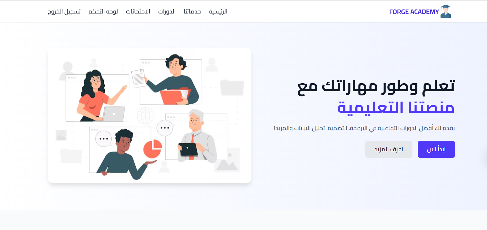

## 📸 Screenshots

  

# Masaaq (مساق) - E-Learning Platform API 🎓

This repository contains the Backend RESTful API for **Masaaq**, a comprehensive educational platform that connects students, instructors, and administrators. 

## 🚀 Live Links
* **Live Application (Frontend):** [Masaaq Netlify App](https://masaaq.netlify.app/)
* **API Documentation:** [Swagger UI (RunASP)](https://masaq01.runasp.net/swagger/index.html)

*(Note: The frontend client is hosted in a separate repository. This repo contains purely the Backend API architecture).*

## 🛠️ Technologies Used
* **Framework:** ASP.NET Core Web API
* **Database:** SQL Server & Entity Framework Core (Code-First Approach)
* **Authentication:** ASP.NET Core Identity & JWT (JSON Web Tokens)
* **Deployment:** ASP.NET Monster (Backend) & Netlify (Frontend)
* **Documentation:** Swagger / OpenAPI

## 🔑 Key Features
* **Role-Based Access Control:** Distinct privileges for Students, Instructors, and Admins.
* **Course Management:** Endpoints for creating, updating, and managing courses and lessons.
* **Assessment System:** Complete quiz creation and submission evaluation workflow.
* **Admin Dashboard Integration:** Secure endpoints serving the administrative interface for platform management.

